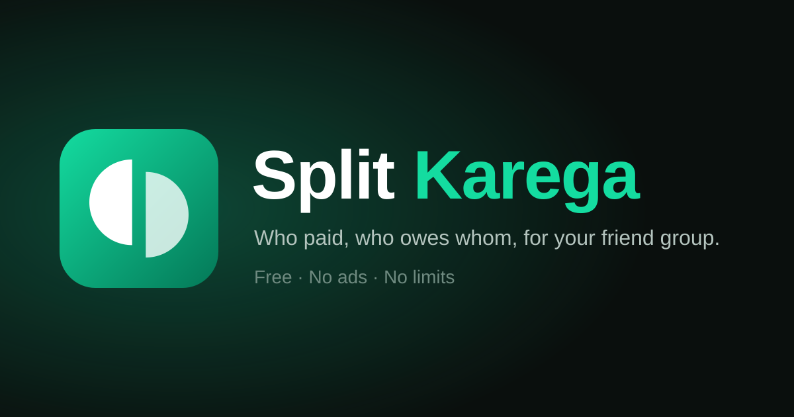

<p align="center">
  
</p>

<p align="center">
  <strong>Split karega?</strong> A free, unlimited Splitwise for your friend group.<br />
  <a href="https://split-karega.vercel.app">split-karega.vercel.app</a>
</p>

Split Karega keeps track of who paid and who owes whom, in groups (trips, households, events) and in one-off expenses with friends. It has no ads, no paywall and no limits, and is built to be hosted for free on Vercel's Hobby plan by one person for their friends.

It is a fork of [Spliit](https://github.com/spliit-app/spliit) by Sebastien Castiel. It adds accounts, members-only groups, a friends view, a Splitwise-style dashboard, settling up with Interac e-Transfer and notifications.

## Features

**Groups and friends**

- Groups for trips, households or events. The group's link is the invite: people open it, log in and join as one of the participants, or add themselves.
- Add friends to a group directly by name or Unique ID. The group then shows up in their "My groups".
- Expenses with one or more friends **outside groups** ("Add expense" on the dashboard or the Friends page).
- **Dashboard** (the homepage when logged in): total balance, "You owe" and "You are owed" per friend, your groups, recent activity, and quick "Add an expense" and "Settle up" buttons.
- **Friends** page: what each friend owes you, or you owe them, across all your groups, per currency.

**Expenses**

- Split evenly, by shares, by percentage or by amount. Includes reimbursements, categories, notes, dates and recurring expenses.
- Expenses in another currency, converted to the group's currency.
- Search, activity log, stats, and CSV/JSON export per group.

**Settling up**

- Suggested reimbursements per group, so only a few payments settle everyone.
- **Pay with Interac:** shows the friend's Interac e-Transfer email, the amount and a message to copy into your bank app, then records the payment in one tap. Each user sets their Interac email in their profile; the login email is never shown to others.

**Notifications**

- A bell in the header for payments, new expenses, changes and being added to a group.
- An optional **daily email summary**. Each user chooses in their profile what it includes.

**Accounts**

- Sign up with a display name, a Unique ID and an email. Groups are members-only.
- "Forgot password?" by email, and login rate limiting.
- Installable as an app (PWA), with light and dark themes. English only.

## Stack

- [Next.js](https://nextjs.org/) (App Router), React and [tRPC](https://trpc.io/)
- [Prisma](https://prisma.io) with PostgreSQL
- [TailwindCSS](https://tailwindcss.com/) and [shadcn/ui](https://ui.shadcn.com/)
- [Nodemailer](https://nodemailer.com/) for email (any SMTP server, e.g. Gmail)
- [Vercel](https://vercel.com/) for hosting and the daily cron job, and GitHub Actions for CI and backups

## Run locally

1. Clone the repository.
2. Start PostgreSQL. `./scripts/start-local-db.sh` runs one in Docker if you don't have one.
3. Copy `.env.example` to `.env` and set `JWT_SECRET` to a random string of at least 32 characters (`openssl rand -hex 32`).
4. `npm install`. This also applies the database migrations and generates the Prisma client.
5. `npm run dev`, then open http://localhost:3000 and sign up.

Without email settings, password reset links and notification summaries are printed to the server console. Open http://localhost:3000/api/cron/notifications to send the summaries on demand.

### Checks

These are the same checks CI runs on every pull request (`.github/workflows/ci.yml`):

```bash
npm run check-types        # TypeScript
npm run lint               # ESLint
npm run check-formatting   # Prettier (npm run prettier to fix)
npm test                   # Jest
```

## Deploy on Vercel

1. Import the repository in Vercel and connect a PostgreSQL database (e.g. Storage → Prisma Postgres, or Neon).
2. Set the environment variables below, then deploy.

Every build runs `prisma migrate deploy` (via `npm install`), so each deployment applies pending migrations to its database. Previews can share the production database, as split-karega.vercel.app does (keep migrations additive), or use a separate one so unmerged branches never touch production data.

The database must be empty or created by `prisma migrate`. A database made with `prisma db push` fails with `P3005`: reset it or [baseline it](https://www.prisma.io/docs/orm/prisma-migrate/workflows/baselining).

| Variable                            | Needed for                                | Where                        | Value                                                                        |
| ----------------------------------- | ----------------------------------------- | ---------------------------- | ---------------------------------------------------------------------------- |
| `POSTGRES_URL`                      | everything                                | Production + Preview         | the **direct** `postgres://…` connection string (not `prisma+postgres://`)   |
| `JWT_SECRET`                        | logins                                    | Production + Preview, secret | 32+ random characters (`openssl rand -hex 32`)                               |
| `NEXT_PUBLIC_BASE_URL`              | links in emails and link previews         | Production only              | e.g. `https://split-karega.vercel.app` (previews use their own address)      |
| `SMTP_URL`                          | password reset and summary emails         | Production + Preview, secret | e.g. `smtps://splitkarega.app%40gmail.com:<app-password>@smtp.gmail.com:465` |
| `EMAIL_FROM`                        | email sender name (optional)              | Production + Preview         | e.g. `Split Karega <splitkarega.app@gmail.com>`                              |
| `CRON_SECRET`                       | the daily summary                         | Production, secret           | 32+ random characters                                                        |
| `NEXT_PUBLIC_DEFAULT_CURRENCY_CODE` | default currency of new groups (optional) | any                          | e.g. `CAD`                                                                   |

### Email (Gmail)

Password reset and the daily summary are sent over SMTP. A free Gmail account allows up to 500 emails a day, which is plenty for a friend group. Use a Gmail account just for the app, so your personal address isn't the sender:

1. Create the account (e.g. `splitkarega.app@gmail.com`) and turn on **2-Step Verification**.
2. Go to Google Account → Security → **App passwords** and create one, e.g. named "Split Karega".
3. Set `SMTP_URL`:
   - write the `@` of the address as `%40`
   - remove the spaces from the app password
4. Optionally set `EMAIL_FROM`. Then redeploy.

Emails from a new address may land in Spam at first. The "Check your email" page asks people to mark them "Not spam", which teaches Gmail to trust the address.

Without `SMTP_URL`, the "Forgot password?" page says reset by email isn't set up, and summaries aren't sent.

- **Reset links:** valid for 1 hour, and work once.
- **Limits:** 5 reset requests per IP address per 15 minutes, and one email per account per minute.

### Notifications and the daily summary

- **Who gets them:** everyone involved in the change who has an account, except the person who made it.
- **In the app:** the bell shows them right away.
- **The daily summary:**
  - Sent by a [Vercel Cron job](https://vercel.com/docs/cron-jobs) (`vercel.json`) that calls `/api/cron/notifications` every day at 13:00 UTC, around 9 am Eastern. On Hobby it runs sometime within that hour.
  - People only get it on days something happened. Each person's profile checkboxes decide what's included, and all are on by default.
- **Securing the endpoint:** set `CRON_SECRET` and redeploy. Vercel sends the secret with each cron request, and anything else gets `401`.
- **Sending it now:** Settings → **Cron Jobs** → **Run**.

## Backups

The [Database backup](.github/workflows/db-backup.yml) workflow runs every night. It dumps the database with `pg_dump`, encrypts the dump with a passphrase, and keeps it as a workflow artifact for 30 days. Encryption matters because anyone on GitHub can download the artifacts of a public repository.

Setup: in GitHub, go to **Settings** → **Secrets and variables** → **Actions** and add:

- `BACKUP_DATABASE_URL`: the direct `postgres://…` connection string (the same as `POSTGRES_URL`)
- `BACKUP_PASSPHRASE`: a long random passphrase. Keep it in your password manager: without it, the backups can't be read.

To back up right away, go to **Actions** → **Database backup** → **Run workflow**. GitHub emails you if a scheduled run fails.

To restore, download the artifact (a zip containing `backup.dump.gpg`) from the workflow run, then:

```bash
gpg --decrypt backup.dump.gpg > backup.dump   # asks for BACKUP_PASSPHRASE
pg_restore --clean --if-exists --no-owner --no-privileges -d "<postgres://… URL of the target database>" backup.dump
```

`pg_restore` replaces the tables in the target database, so try it on an empty database first.

## Run in a container

1. `npm run build-image` builds the Docker image.
2. Copy `container.env.example` to `container.env` and set `JWT_SECRET`.
3. `npm run start-container` starts PostgreSQL and the app on http://localhost:3000.

Pushing a git tag publishes an image to the GitHub Container Registry (`.github/workflows/cd.yml`).

## Health check

- `GET /api/health` or `GET /api/health/readiness`: the app is ready, including the database connection.
- `GET /api/health/liveness`: the app is running.

## Optional features

These come from Spliit and are off by default.

### Receipt photos

Attach images to expenses, stored in an S3 bucket (AWS or any S3-compatible provider). Create a bucket and an IAM user as described in [next-s3-upload](https://next-s3-upload.codingvalue.com/setup#s3-bucket), then set:

```.env
NEXT_PUBLIC_ENABLE_EXPENSE_DOCUMENTS=true
S3_UPLOAD_KEY=AAAAAAAAAAAAAAAAAAAA
S3_UPLOAD_SECRET=AAAAAAAAAAAAAAAAAAAAAAAAAAAAAAAAAAAAAAAA
S3_UPLOAD_BUCKET=name-of-s3-bucket
S3_UPLOAD_REGION=us-east-1
# For other S3 providers:
S3_UPLOAD_ENDPOINT=http://localhost:9000
```

### Create an expense from a receipt, and guess the category

Both use the OpenAI API, which needs paid credits. Receipt scanning also needs receipt photos (above).

```.env
NEXT_PUBLIC_ENABLE_RECEIPT_EXTRACT=true
NEXT_PUBLIC_ENABLE_CATEGORY_EXTRACT=true
OPENAI_API_KEY=XXXXXXXXXXXXXXXXXXXXXXXXXXXX
```

## Project notes

- **Language:** English only (`messages/en-US.json`). To add one, add `messages/<locale>.json` and list it in `src/i18n/request.ts`.
- **Logo:** the SVG masters are in `public/brand/`. `npm run generate-logos` renders the favicon, app icons, splash and social banner from them.
- **Changes:** see [CHANGELOG.md](./CHANGELOG.md).

## Credits and license

Split Karega is based on [Spliit](https://github.com/spliit-app/spliit) by [Sebastien Castiel](https://github.com/scastiel) and its contributors. If you'd like to support the original project, you can [sponsor Sebastien](https://github.com/sponsors/scastiel).

MIT, see [LICENSE](./LICENSE).
